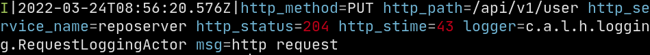

# Jaxe - The J[son] [Pick]axe

jaxe parses [new line delimited json](http://ndjson.org/) on the stdin
and outputs a color human readable string on stdout.

jaxe supports basic filtering with a simple language. Certain json
values can be omited or extracted. Invalid json can be displayed in a
different color or omitted.


## Examples

Considering the following newline delimited json log line:

```
$ cat example.log | jq
{
  "logger": "c.a.l.h.logging.RequestLoggingActor",
  "http_stime": "43",
  "http_method": "PUT",
  "http_path": "/api/v1/user",
  "at": "2022-03-24T08:56:20.576Z",
  "http_service_name": "reposerver",
  "msg": "http request",
  "http_status": "204",
  "level": "INFO"
}
```


Piping that line to jaxe will output:

```
I|2022-03-24T08:56:20.576Z|http_method=PUT http_path=/api/v1/user http_service_name=reposerver http_status=204 http_stime=43 logger=c.a.l.h.logging.RequestLoggingActor msg=http request
```
The output is colorized unless you use `-n/--no-colors`:



non json lines will be printed verbatim unless `-j/--no-omit-json` is used.

Often you have fields you don't care about, you can set `JAXE_OMIT` or use `-o/`to filter those fields out:

```
$ export JAXE_OMIT="logger,http_service_name"
$ cat example.log | jaxe
I|2022-03-24T08:56:20.576Z|http_method=PUT http_path=/api/v1/user http_status=204 http_stime=43 msg=http request
```

A DSL can be used to filter log lines, using `-f/--filter` or `JAXE_FILTER`:

```
$ cat example.log | jaxe --filter 'http_status==404'
$
$ cat example.log | jaxe --filter 'http_status==204'
I|2022-03-24T08:56:20.576Z|http_method=PUT http_path=/api/v1/user http_status=204 http_stime=43 msg=http request
$
$ cat example.log | jaxe --filter 'and(contains(msg,"http request"), not(contains(msg,"username")))'
```

You can extract only certains values from the json:

```
$ cat example.log | jaxe --extract http_method,http_status,msg
I|2022-03-24T08:56:20.576Z|http_method=PUT http_status=204 msg=http request 
```

### Filtering DSL

The following DSL can be used with `-f/--filter` to filter lines. `.`
can be used to refer to values nested in json objects.


|                   Expression | Example                                            |
|-----------------------------:|:--------------------------------------------------:|
| equals/not equals `==`, `!=` | `mykey0.otherkey == myvalue`                       |
|           `and(exp)/or(exp)` | `and(http_status == 200, http_method != GET)`      |
|                   `not(exp)` | `not(and(http_status == 200, http_method != GET))` |
|         `contains(key, str)` | `contains(mykey, somestr)`                         |
|                `exists(key)` | `exists(mykey)`                                    |

## Configuration

`JAXE_OMIT` and `JAXE_FILTER` can be set the same was as `-o/--omit` and `-f/--filter`.

## Install

Binaries can be downloaded for the releases tab.


